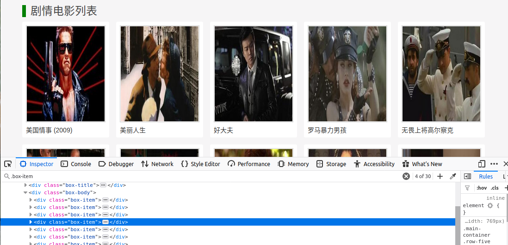

# Scrapy 2.0

## overview architecture


### Data flow
*   The Engine gets the initial Requests to crawl from the Spider.
*   The Engine schedules the Requests in the Scheduler and asks for the next Requests to crawl.
*   The Scheduler returns the next Requests to the Engine.
*   The Engine sends the Requests to the Downloader, passing through the Downloader Middlewares (see process_request()).
*   Once the page finishes downloading the Downloader generates a Response (with that page) and sends it to the Engine, passing through the Downloader Middlewares (see process_response()).
*   The Engine receives the Response from the Downloader and sends it to the Spider for processing, passing through the Spider Middleware (see process_spider_input()).
*   The Spider processes the Response and returns scraped items and new Requests (to follow) to the Engine, passing through the Spider Middleware (see process_spider_output()).
*   The Engine sends processed items to Item Pipelines, then send processed Requests to the Scheduler and asks for possible next Requests to crawl.
*   The process repeats (from step 1) until there are no more requests from the Scheduler.

### Components
[Spiders](https://docs.scrapy.org/en/latest/topics/spiders.html)

Write the rules to crawl your websites.

[Item Pipeline](https://docs.scrapy.org/en/latest/topics/item-pipeline.html)

Post-process and store your scraped data.

[Selectors](https://docs.scrapy.org/en/latest/topics/selectors.html)

Extract the data from web pages using XPath.

[Scrapy shell](https://docs.scrapy.org/en/latest/topics/shell.html)

Test your extraction code in an interactive environment.

[Items](https://docs.scrapy.org/en/latest/topics/items.html)

Define the data you want to scrape.

[Item Loaders](https://docs.scrapy.org/en/latest/topics/loaders.html)

Populate your items with the extracted data.


[Feed exports](https://docs.scrapy.org/en/latest/topics/feed-exports.html)

Output your scraped data using different formats and storages.

[Requests and Responses](https://docs.scrapy.org/en/latest/topics/request-response.html)

Understand the classes used to represent HTTP requests and responses.

[Link Extractors](https://docs.scrapy.org/en/latest/topics/link-extractors.html)

Convenient classes to extract links to follow from pages.

[Settings](https://docs.scrapy.org/en/latest/topics/settings.html)

Learn how to configure Scrapy and see all [available settings](https://docs.scrapy.org/en/latest/topics/settings.html#topics-settings-ref).

[Exceptions](https://docs.scrapy.org/en/latest/topics/exceptions.html)

See all available exceptions and their meaning.


## Basic work flow
1. Create a project with command
```shell
scrapy startproject ProjectName
```
Structure of created project as follows:

    tutorial/
        scrapy.cfg            # deploy configuration file

        tutorial/             # project's Python module, you'll import your code from here
            __init__.py

            items.py          # project items definition file;

            middlewares.py    # project middlewares file

            pipelines.py      # used to post process each spider's parse result, for example save to db

            settings.py       # project settings file

            spiders/          # a directory where you'll later put your spiders
                __init__.py


2. Generate a spider
```shell
scrapy genspider [-t template] <name> <domain>
```
Template can be basic, crawl, csvfeed, xmlfeed. 
```python
class NewspiderSpider(scrapy.Spider):
    name = 'newspider'
    allowed_domains = ['lagou.com']    #url beyond this domain will not be crawl
    start_urls = ['http://lagou.com/'] #first requests will call this urls

    def parse(self, response):    # parse result 
        for quote in response.css("div.quote"):
            yield {
                'text': quote.css("span.text::text").extract_first(),
                'author': quote.css("small.author::text").extract_first(),
                'tags': quote.css("div.tags > a.tag::text").extract()
            }

        # parse next urls
        next_page_url = response.css("li.next > a::attr(href)").extract_first()
        if next_page_url is not None:
            yield scrapy.Request(response.urljoin(next_page_url))
```
During develop parse function, we can use `scrapy shell 'url'` to do parse test.
We can click `F12` to verify css selector.




3. Define item to store
Edit items.py to add saved item for each request.

4. Define post process
We can define multi pipeline in pipelines.py to process the same item. Then we register pipeline in settings.py by add new pipeline in ITEM_PIPELINES dict. Value for dict is the weight. The bigger weight will be exacuted earlier.
```python
ITEM_PIPELINES = {
   'cloud.pipelines.CloudPipeline': 300,
}
```
5. run spider
```shell
scrapy crawl <spider name>
```